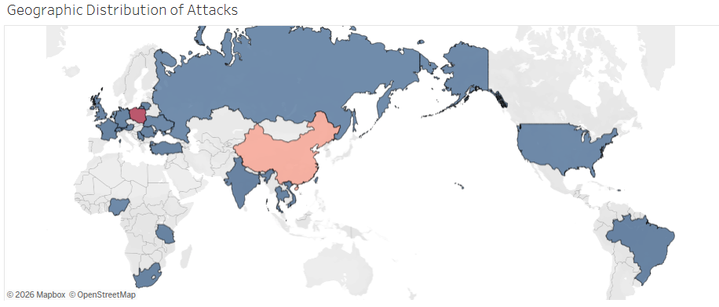
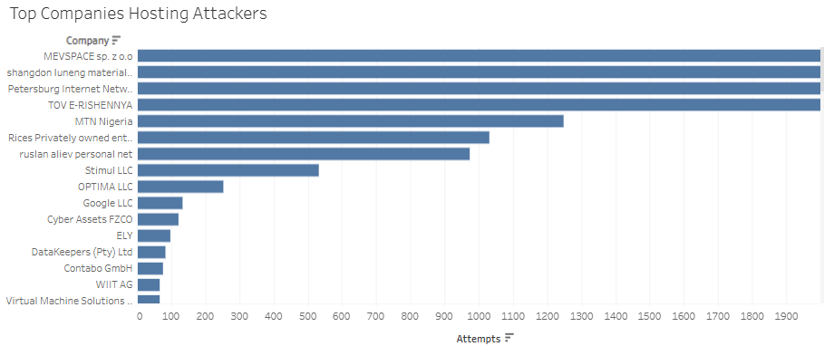

# Azure AD Honeypot SIEM Project (Microsoft Sentinel)

## 🧠 Executive Summary
This project simulates a real-world Security Operations Center (SOC) scenario by deploying a deliberately vulnerable Windows-based virtual machine in Microsoft Azure to act as a honeypot. The system was exposed to the public internet via RDP (port 3389) to attract malicious activity.

Logs were ingested into Microsoft Sentinel using the Azure Monitor Agent, where security events (specifically Event ID 4625 – failed login attempts) were analyzed to identify brute-force attacks, username enumeration, and attacker behavior patterns across multiple regions and hosting providers.

---

## 🏗️ Architecture Overview
- **Cloud Platform:** Microsoft Azure  
- **Virtual Machine:** Windows 10 (Honeypot)  
- **SIEM:** Microsoft Sentinel  
- **Log Ingestion:** Azure Monitor Agent (AMA)  
- **Log Source:** Windows Security Events  
- **Attack Vector:** Public RDP Exposure (3389)  

### 🔁 Data Flow
1. Public internet → RDP brute force attempts  
2. Windows VM logs security events  
3. Azure Monitor Agent collects logs  
4. Logs sent to Log Analytics Workspace  
5. Microsoft Sentinel ingests and analyzes data  

---

## 🚨 Honeypot Configuration
The virtual machine was intentionally configured with:
- Public IP address
- Open RDP port (3389) to all IP addresses
- Minimal security hardening

> ⚠️ This configuration is intentionally insecure and should **never** be used in production environments.

This setup allows attackers to:
- Attempt credential-based attacks
- Enumerate usernames
- Perform automated brute-force attempts

---

## 📊 Log Collection & SIEM Integration
- Configured **Log Analytics Workspace**
- Enabled **Microsoft Sentinel**
- Installed **Azure Monitor Agent (AMA)**
- Connected **Windows Security Events via AMA**

### Key Event Monitored:
- **Event ID 4625** → Failed login attempts

---

## 🔍 Attack Analysis

### 📈 Attack Volume
Over a **3-day period**, the honeypot captured:
- **30,000+ login attempts from a single source**
- Multiple additional sources with thousands of attempts
- Continuous attack patterns indicating automation

---

### 🌍 Geographic Distribution of Attacks

> 📌 This visualization (created in Tableau) highlights global attack sources, showing concentration in specific regions.

---

### 🏢 Top Hosting Providers Used by Attackers

> 📌 This chart shows the most common hosting providers used in attack attempts, indicating likely use of VPS infrastructure and botnets.

---

### 🧨 Observed Attack Techniques

#### 1. Brute Force Attacks (MITRE T1110)
- High-frequency login attempts
- Thousands of repeated authentication failures
- Automated attack behavior

#### 2. Username Enumeration
Attackers attempted common and service-based usernames:
- Administrator, Admin, Root  
- SQLServer, FTP, Support  
- Business roles: HR, Manager, Accounting  

#### 3. Credential Spraying
- Large sets of usernames tested with repeated attempts
- Indicates use of known credential lists

#### 4. Global Attack Patterns
- Usernames in multiple languages
- Suggests distributed attack infrastructure

---

## 🧪 Sample Log Data
Example of captured event:
